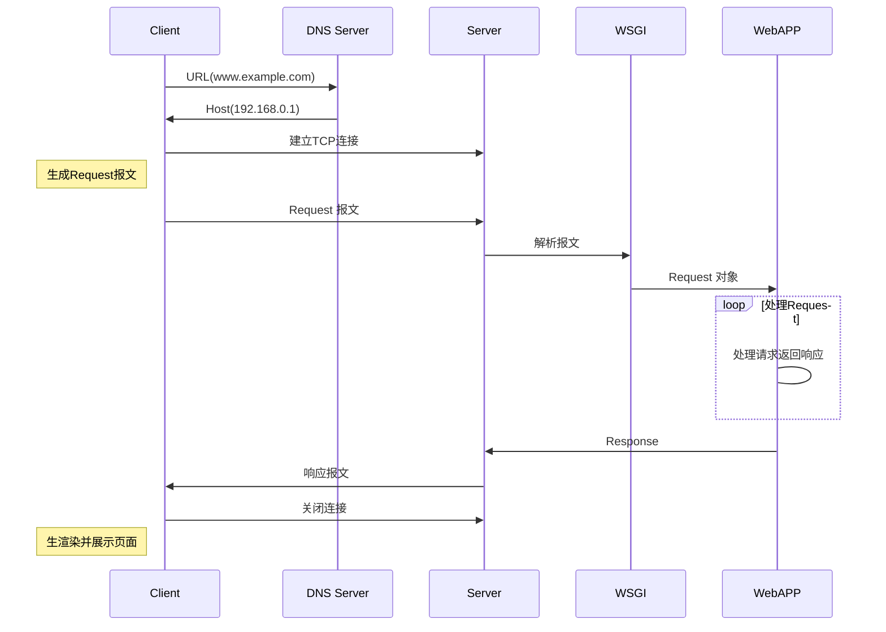

# Day01-数据采集基础

[TOC]

## 爬虫
### 什么是爬虫

- 生活角度：
	
	爬虫，蜘蛛（spider），网
	
- 互联网
	
	网：互联网，上面的节点就是很多的url（统一资源定位符）
	
- 互联网爬虫：
	
	就是写一个程序，就是根据url用来爬取网页，然后将网页中的你所需要的数据提取出来。

### 用什么爬虫

- php
	
	号称是世界最优美的语言，但是他不是很擅长这个，对多进程多线程支持的不好
	
- java
	
	做起来也非常的不错，是python爬虫最主要的对手，代码太臃肿，代码量很大，重构成本非常的大，而我们爬虫需要根据需求经常修改，所以它不好
	
- c、c++
	
	学习成本比较高，性能和效率非常高，没这么做的，仅仅是一个能力的体现
	
- python
	
	好，语法优美、代码简单，学习成本低，支持的模块多，有一个非常强大的爬虫框架，scrapy

### 爬虫分类


#### 通用爬虫
百度、360、谷歌、搜狗、必应等搜索引擎,搜索引擎使用的爬虫就是通用爬虫.

- 通用爬虫都干了啥

    1. 抓取网页		
    2. 抓取数据
    3. 数据存储
    4. 数据处理
    5. 给你提供了检索服务

- 抓取流程：
  	1. 给一些起始的url，放入待爬取url队列
   2. 从队列中取出url，开始爬取
   3. 分析内容，获取网页中所有的url，继续执行第二步，直到结束
   
 - 搜索引擎如何获取一个新的网站的链接
    	
     1. 主动给搜索引擎提交url
     2. 在其它网站中设置友情链接
     3. 百度和DNS服务商进行合作，加速收录新网站
     
 - robots协议
    	
     [淘宝](http://www.taobao.com/robots.txt)
     
     可以限制通用爬虫的抓取，哪些可以抓(Allow)，哪些不能抓(Disallow)
     
      仅仅是一个君子协议，一般情况只有大型搜索引擎遵从这个协议。
     
 - 网站排名
    	1. 根据pagerank值排名，根据流量、点击率等等进行综合的计算进行排名，值越高，排名越靠前
     2. 百度竞价排名(SEO)，谁给的钱多，谁在最前。
     
- 缺点：
     1. 抓取的很多数据都是无用的。
     2. 不能根据用户的需求来抓取对应的数据

#### 聚焦爬虫
根据自己的需求，去写一个网络爬虫程序，抓取对应的数据即可

- 爬虫如何抓取网页数据

网页都有特点：

1. 网页都有自己的唯一的统一资源定位符（url）
2. 网页都是有html组成的
3. 传输协议使用的都是http、https协议

爬虫设计的思路是：

1. 给我一个url
2. 模拟浏览器通过http协议访问url，获取到这个url的html代码
3. 解析字符串（根据一定规则提取你所需要的数据）

开发环境：
	python3

整体内容：

1. python语法、HTTP交互原理

  2. 如何抓取页面，使用到python库
       `urllib` 、 `requests`

  3. 解析内容
       `re(正则表达式)`、`xpath`、`bs4`、`jsonpath`

  4. 采集动态html
       `selenium `+`chromium`/`phantomjs`

  5. 框架
       `scrapy`高性能异步网络框架

  6. 分布式框架

       `scrapy-redis` ，在scrapy的基础上增了一套组件，结合redis进行队列、存储等功能

  7. 爬虫-反爬虫-反反爬虫之间的博弈过程

       其实爬虫的难点，不是复杂的界面，不是数据的提取，而是和对面相互博弈的过程
        反爬虫的一般手段：

       - 用户身份识别
       - IP访问频次限制
       - 验证码
       - 动态数据加载
       - 数据加密

       最终肯定能获取数据，公司值不值得，因为只要浏览器能够正常访问，那么数据就能拿到


--------------


## HTTP协议

***HyperText Transfer Protocol（超文本传输协议）*** 

### HTTP简介

1. 发展版本	

   | 版本     | 内容   | 内容                                                         | 发展状况           |
   | -------- | ------ | ------------------------------------------------------------ | ------------------ |
   | HTTP/0.9 | 1991年 | 不涉及数据包传输，规定客户端和服务器之间通信格式，只能GET请求 | 没有作为正式的标准 |
   | HTTP/1.0 | 1996年 | 传输内容格式不限制，增加PUT、PATCH、HEAD、 OPTIONS、DELETE命令 | 正式作为标准       |
   | HTTP/1.1 | 1997年 | 持久连接(长连接)、节约带宽、HOST域、管道机制、分块传输编码   | 2015年前使用最广泛 |
   | HTTP/2   | 2015年 | 多路复用、服务器推送、头信息压缩、二进制协议等               | 逐渐覆盖市场       |

2. 构建在 TCP 应用层之上的协议

3. 应用领域

   几乎涵盖所有日常的互联网场景

### URL的构成 

***Uniform Resource Locator(统一资源定位符)***

 **`http://www.example.com:80/foo/bar/readme?x=0y=abc#part1`**

| `http://` | `www.example.com` | `:80` | `/foo/bar/readme` | `?x=0&y=abc` | `#part1` |
| --------- | ----------------- | ----- | ----------------- | ------------ | -------- |
| 协议      | 域名/主机名       | 端口  | 路由              | 参数         | 锚点     |
| Scheme    | Host[name]        | Port  | Path              | Query        | Fagement |

### HTTP交互过程




过程描述：

1. DNS解析

2. 建立TCP（三次握手）

   ```mermaid
   sequenceDiagram
   participant Client
   participant Server
   note left of Client :Client发送SYN报文<br/>并设置发送序列号为X
   Client ->> Server : SYN=1,Seq=X
   note right of Server :Server发送SYN+<br/>ACK报文并设置<br/>发送序列号为Y<br/>确认序列号为X+1
   Server ->> Client : SYN=1,ACK=X+1,Seq=Y
   note left of Client :Client发送ACK报文<br/>并设置发送序列号为Z<br/>确认序列号为Y+1
   Client ->> Server : ACK=Y+1,Seq=Z
   note right of Server :完成连接
   ```

   

3. 生成 Request 报文

4. Client 发送 Request 报文

5. Server 接收报文

6. 通过 WSGI 解析报文, 获得 Request 对象

7. Django、Flask 等应用程序进行逻辑处理

   1. process_request (Middleware)
   2. URL match
   3. process_views (Middleware)
   4. Views --> process_exception
   5. Redner Template
   6. Response
   7. process_response (Middleware)

8. 从 Response 对象生成报文

9. Server 返回报文给 Client

10. 关闭连接（4次挥手）

   ```mermaid
   sequenceDiagram
   participant Client
   participant Server
   note left of Client :Client发送FIN+Ack<br/>报文并设置发送序列号<br/>为X
   Client ->> Server :FIN=1,Ack=1,Seq=X
   note right of Server :Server发送ACK报文并设置<br/>发送序列号为Z<br/>确认序列号为X+1
   Server ->> Client :ACK=X+1,Seq=Z
   note right of Server :Server发送FIN+<br/>ACK报文并设置<br/>发送序列号为Y<br/>确认序列号为X
   Server ->> Client :FIN=1,Ack=X,Seq=Y
   note left of Client :Client发送ACK报文<br/>并设置发送序列号为X<br/>确认序列号为Y
   Client ->> Server :ACK=Y,Seq=X
   ```

   

11. 解析、渲染 HTML 页面


### 报文

- 请求报文

  <table>
  <tr>
    <td>请求方法</td> 
    <td>空格</td>
    <td>URL</td>
    <td>空格</td>
    <td>协议版本</td>
    <td>回车符</td>
    <td>换行符</td>
  </tr>
  <tr>
    <td>请求头部字段名</td>
    <td>冒号</td>
    <td colspan="3">值</td>
    <td>回车符</td>
    <td>换行符</td>
  </tr>
  <tr>
    <td>请求头部字段名</td>
    <td>冒号</td>
    <td colspan="3">值</td>
    <td>回车符</td>
    <td>换行符</td>
  </tr>
  <tr>
     <td colspan="7">空行</td> 
  </tr>
   <tr>
     <td colspan="7">请求包体</td>    
   </tr>

  
  
 - 响应报文

   <table>
   <tr>
     <td>协议版本</td> 
     <td>空格</td>
     <td>状态码</td>
     <td>空格</td>
     <td>状态码描述</td>
     <td>回车符</td>
     <td>换行符</td>
   </tr>
   <tr>
     <td>响应头部字段名</td>
     <td>冒号</td>
     <td colspan="3">值</td>
     <td>回车符</td>
     <td>换行符</td>
   </tr>
   <tr>
     <td>响应头部字段名</td>
     <td>冒号</td>
     <td colspan="3">值</td>
     <td>回车符</td>
     <td>换行符</td>
   </tr>
   <tr>
      <td colspan="7">空行</td> 
   </tr>
    <tr>
      <td colspan="7">响应包体</td>    
    </tr>

### GET 和 POST

- 表象
  - GET 在浏览器可以回退, 而 POST 则会再次提交请求
  - GET 的 URL 可以被 Bookmark, 而 POST 不可以.
  - GET 请求会被浏览器主动缓存, 而 POST 不会, 除非手动设置.
  - GET 请求参数会被完整保留在浏览器历史记录里, 而 POST 中的参数不会被保留.
  - GET 请求的数据只能进行 URL 编码, 而 POST 支持多种编码方式.
  - GET 请求在 URL 中传送的参数是有长度限制的 (URL 的最大长度是 2048 个字符), 而 POST 没有.
  - 对参数的数据类型, GET 只接受 ASCII 字符, 而 POST 没有限制.
  - GET 比 POST 更不安全, 因为参数直接暴露在URL上, 所以不能用来传递敏感信息.
  - GET 参数通过 URL 传递, POST 放在 Request body 中.
- 深层
  - GET 产生一个TCP数据包；POST产生两个TCP数据包.
  - GET: 浏览器会把 http 的 header和data一并发送出去, 服务器响应200（返回数据）；
  - POST: 浏览器先发送 header, 服务器响应 100 continue, 浏览器再发送data, 服务器响应200 ok（返回数据）.

### Header

- 请求头

  ```
  #发送请求的时候，告诉服务器可以接受那些内容，MIME	Accept:text/html,application/xhtml+xml,application/xml;q=0.9,image/webp,image/apng,*/*;q=0.8
  #客户端可以接受的编码类型
  Accept-Encoding:gzip, deflate, br
  #接受的语言类型
  Accept-Language:zh-CN,zh;q=0.9
  #和缓存相关
  Cache-Control:max-age=0
  #连接方式，保持长连接
  Connection:keep-alive
  #会话相关
  Cookie:BIDUPSID=9F5816DD3088F4291EA4C12FFC2ABCDE; BAIDUID=78AF1CE91C8F84BD601F6E2778C618DA:FG=1; PSTM=1513827071; BD_UPN=12314353; H_PS_PSSID=1454_21125_18559_25177; BD_CK_SAM=1; PSINO=2; BDORZ=B490B5EBF6F3CD402E515D22BCDA1598; pgv_pvi=769396736; pgv_si=s5038345216; BD_HOME=0; H_PS_645EC=3ff96rRFDTjHDZ%2BqFcj5%2FYOP6KISjZyhvnS1a%2B1q4A19NgE%2FSjllKIn8ejA
  #主机
  Host:www.baidu.com
  #是否升级为https请求
  Upgrade-Insecure-Requests:1
  #客户端浏览器类型
  User-Agent:Mozilla/5.0 (Windows NT 6.1; Win64; x64) AppleWebKit/537.36 (KHTML, like Gecko) Chrome/63.0.3239.108 Safari/537.36
  #如果是ajax请求，一般都带这个
  X-Requested-With: XMLHttpRequest
  #上一个页面，你从哪个页面过来的
  Referer: https://www.baidu.com/?tn=57095150_6_oem_dg
  ```

- 响应头

  ```
  # 连接方式
  Connection:Keep-Alive
  #内容编码格式
  Content-Encoding:gzip
  #内容类型
  Content-Type:text/html; charset=utf-8
  #请求体/响应体的长度
  Content-Length:3214 
  #时间
  Date:Sun, 24 Dec 2017 04:21:28 GMT
  #过期时间
  Expires:Sun, 24 Dec 2017 04:20:29 GMT
  #服务器版本
  Server:BWS/1.1
  #给客户端保存的cookie值
  Set-Cookie:BDSVRTM=0; path=/
  Set-Cookie:BD_HOME=0; path=/
  Set-Cookie:H_PS_PSSID=1454_21125_18559_25177; path=/; domain=.baidu.com
  #内容是否分块传输
  Transfer-Encoding:chunked
  ```

  

### HTTP 状态码

常见HTTP状态码

- 200 **OK** 成功
- 301 **Moved Permanently** 重定向 (永久迁移)
- 302 **Moved Temporarily** 重定向 (临时迁移)
- 303 **See Other** 重定向 (非 GET 请求的重定向)
- 400 **Bad Request** 客户端请求错误
- 403 **Forbidden** 拒绝访问
- 404 **Not Found** 找不到页面
- 500 **Internal Server Error** 服务器内部错误
- 502 **Bad Gateway** 网关错误
- 503 **Service Unavailable** 服务器维护或者过载
- 504 **Gateway Timeout** 请求超时


### Cookie 和 Session

- 无状态协议的无奈之举
  - 通信如同一次无法看到脸的握手, 如何识别用户
- 异同
  1. session 在服务器端, cookie 在客户端（浏览器）
  2. session 默认被存在在服务器的一个文件里（不是内存）
  3. session 的运行依赖 session id, 而 session id 是存在 cookie 中的, 也就是说, 如果浏览器禁用了 cookie , 同时 session 也会失效（但是可以通过其它方式实现, 比如在 url 中传递 session_id）
  4. session 可以放在 文件、数据库、或内存中都可以.
  5. 用户验证这种场合一般会用 session
- 产生1过程
  1. 客户端请求
  2. 服务器产生 session_id, 并传回浏览器
  3. 浏览器将 session_id 写入 cookie
  4. 后续请求会写入 Header


### HTTPS

​	 ***Hypertext Transfer Protocol Secure(超文本传输安全协议)***

1. 起源

  **网景**在1994年创建了HTTPS，并应用在网景导航者浏览器中。 最初，HTTPS是与SSL一起使用的；在`SSL`逐渐演变到`TLS`时，最新的HTTPS也由在2000年五月公布的RFC 2818正式确定下来。

2. 优点

  - 防窃听: 建立一个信息安全通道，来保证数据传输的安全
  - 防篡改: 防止内容被第三方修改
  - 放冒充: 确认网站的真实性

3. 缺点

  - 加密、解密消耗 CPU
  - 握手过程繁琐

4. 加密算法

  - 对称加密（加密和解密用同样的Key）

    ```
    text: abcdefg
              |  ^
            v  |
      key:    1234
              |  ^
              v  |
    new:  hasjdkfhasdf
    ```
  
  - 常见对称加密方式

    - TEA

      加密强度比较低，但是速度快！代表QQ消息的加密(16轮加密)
      
    -  AES
  
      强度速度兼具，没有TEA快但是强度远大于TEA
      
    -  3DES
  
      3DES是DES加密算法的一种模式，它使用3条64位的密钥对数据进行三次加密。数据加密标准（DES）是美国的一种由来已久的加密标准。3DES是DES向AES过渡的加密算法。

  

  
  
  - 非对称加密（加密和解密用不同的Key）
  
    ```
      text:   abcdefghijklmn
                |       ^
                v       |
      pub_key: 123      |
      pri_key:  |   1234567890123456789546789
                |       ^
                v       |
      new: ajsgdpfqibwfmbsdlkfjbq;ejkwbf;qkbfd
    ```
  
  - 常见非对称加密
  
    - RSA
  
      最早的、应用较广的非对称加密
  
    - ED25519
  
      秘钥最短，强度最强
  
  ```mermaid
  sequenceDiagram
  participant Client
  participant Server
  note left of Client :Client发起请求
  Client ->> Server :支持的协议版本、加密算法，随机数
  note right of Server :Server发送证书
  Server ->> Client :确定的加密协议版本及加密算法，服务器的证书，服务器的随机数
  note left of Client :Client验证证书
  Client ->> Server :随机数(使用证书中公钥加密)，编码改变通知，握手结束通知
  note right of Server :生成秘钥
  Server ->> Client :编码改变通知、握手结束通知
  note left of Client :Client发送数据
  Client -> Server :对称加密传输
  ```
  
  

 
